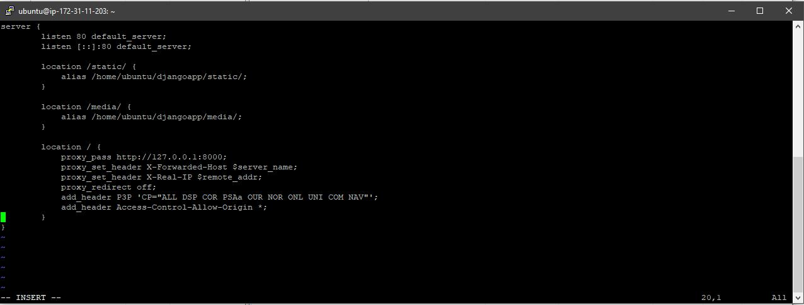

# Server: Ubuntu_NGINX_Gunicorn_djangoapp

## djangoapp

* sudo apt-get update 
* sudo apt-get install -y git python3-dev python3-venv python3-pip supervisor nginx vim libpq-dev
* --> cd djangoapp
* pathon3 -m venv venv
<!--
ubuntu@ip-172-31-11-203:~/djangoapp$ ls
compressormodel  database  djangoapp  manage.py  media  requirements.txt  static  templates  venv  webtools
ubuntu@ip-172-31-11-203:~/djangoapp$ source venv/bin/activate
(venv) ubuntu@ip-172-31-11-203:~/djangoapp$
-->
* source venv/bin/activate
* (venv) pip3 install -r requirements.txt 

## nginx

* sudo apt-get install nginx
* sudo vim /etc/nginx/sites-enabled/default

```
server {
        listen 80 default_server;
        listen [::]:80 default_server;

        location /static/ {
            alias /home/ubuntu/djangoapp/static/; 
        }

        location /media/ {
            alias /home/ubuntu/djangoapp/media/; 
        }

        location / {
            proxy_pass http://127.0.0.1:8000;
            proxy_set_header X-Forwarded-Host $server_name;
            proxy_set_header X-Real-IP $remote_addr;
            proxy_redirect off;
            add_header P3P 'CP="ALL DSP COR PSAa OUR NOR ONL UNI COM NAV"';
            add_header Access-Control-Allow-Origin *;
        }
}
```

## Setup Supervisor

* cd /etc/supervisor/conf.d/
* sudo vim djangoapp.conf

```
[program:djangoapp]
command = /home/ubuntu/djangoapp/venv/bin/gunicorn djangoapp.wsgi  -b 127.0.0.1:8000 -w 4 --timeout 90
autostart=true
autorestart=true
directory=/home/ubuntu/djangoapp 
stderr_logfile=/var/log/game_muster.err.log
stdout_logfile=/var/log/game_muster.out.log
```

## Update supervisor with the new process
* sudo supervisorctl reread
* sudo supervisorctl update
* sudo supervisorctl restart djangoapp
* sudo supervisorctl stop djangoapp


